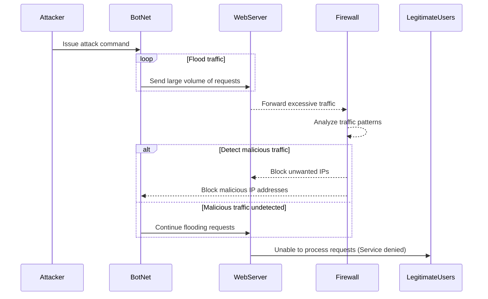

# DDoS Attack Sequence

## Sequence Diagram

Below is a sequence diagram showing the interactions in a DDoS attack involving an attacker, a botnet, a web server, and a firewall:

## Sequence Diagram Steps
#### 1. Attacker Intitiates
 * The attacker sends an execution command to the BotNet
   * Usually using a command-and-control server.

#### 2. BotNet Floods Web Server
 * The BotNet sends a massive amount of HTTP requests or other traffic to the web server.
 * The purpose is to overload the web server's resources.

#### 3. Web Server Becomes Overloaded
 * The server fowards incoming traffic to the firewall as part of the standard network flow.
 * The server can't handle the excessive requests efficiently, which leads to delays in processing legitimate traffic.

#### 4. Firewall Analyzes Traffic
 * The firewall inspects incoming traffic to attempt to differentiate between legitimate and malicious inputs.
   * This process includes exmaining patterns, IP addresses, and request frequency.

#### 5. Service Denied to Legitimate Users
 * During the attack, legitimate users will either have difficulty accessing or will be unable to access the web server due to resource exhaustion.

## Defensive Actions

#### If the firewall detects malicious traffic:
 * The firewall blocks traffic from suspicious IP addresses.
 * Mitigation techniques like rate limiting and IP blacklisting are used to prevent further harm.

#### If the malicious trafffic is not detected:
 * The BotNet continues to send traffic, overwhelms the server, and causes legitimate users to have denial of service.

## Description of Participants

#### Attacker
 * Directs the attack and controls the BotNet using a command-and-control server.

#### BotNet
 * A group of compromised devices used to flood the server with requests.

#### Web Server
 * The target of the attack.
 * Overwhelmed by high traffic volume, resulting in a denial of service for legitimate users.

#### Firewall
 * The network's primary defense system.
 * Responsible for identifying, analyzing, and mitigating malicious requests while allowing legitimate requests to pass through.
